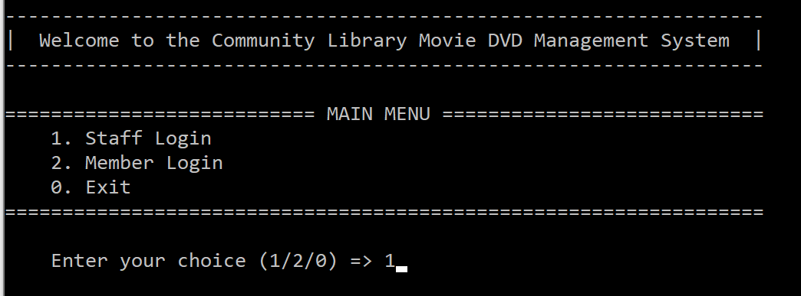
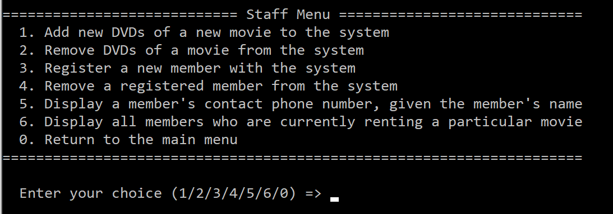
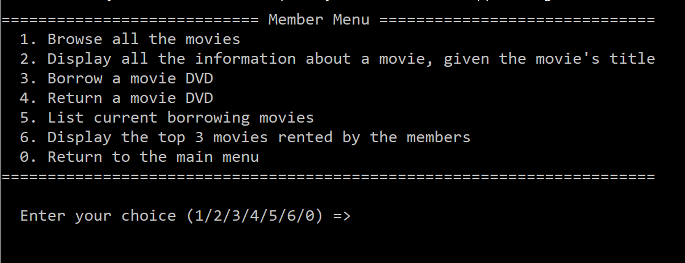

# DVD Management System

#### A console application used to manage library DVDs

#### We applied Object-Oriented Programming, Search Algorithms (e.g. binary search) and different Data Structures (binary tree and array) to interact        with the databse. This project also follows common coding conventions (var names, space, indentation) and implement maintainable, scalable code.

   
## App Demo
### Main menu

### Staff menu

### Member menu

